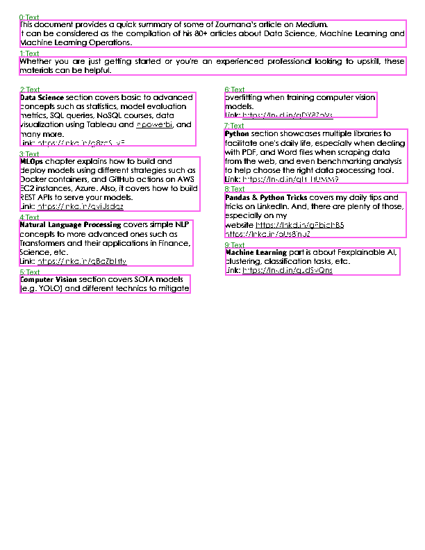
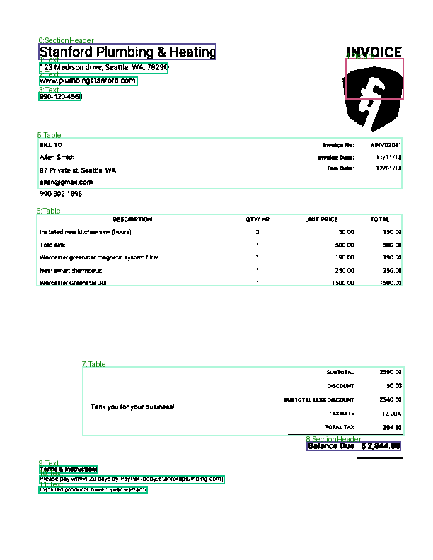
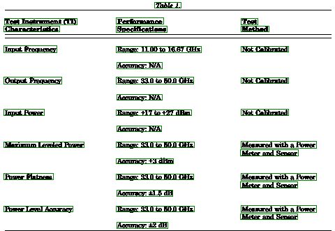

# Document Understanding
 
This repo contains code for a Streamlit based app for extracting data from  PDF documents. 

Have utilised OCR and neural network based tools to extract layout structure and text data from PDF files.

My experimental work is contained in the Jupyter notebook in nbs folder.

Here are some samples:

<!--  -->

<!--  -->

### Run:
The app is build using streamlit and python. Deployed on streamlit cloud and can be accessed here: [Economy Visualizer](to be added)

NOTE: If the app is on sleep mode. Press the button on the screen to bring it back on. App takes about 4-5mins to re-load.

**To run it locally:**
1. Install the python packages mentioned in the `requirements.txt` file. 
2. Then run the following command from the console: `streamlit run src/home.py`

The app should open in your web browser.

